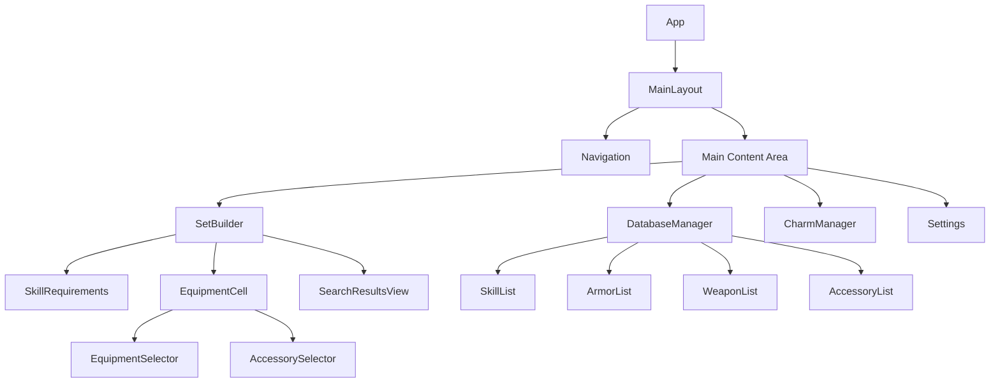
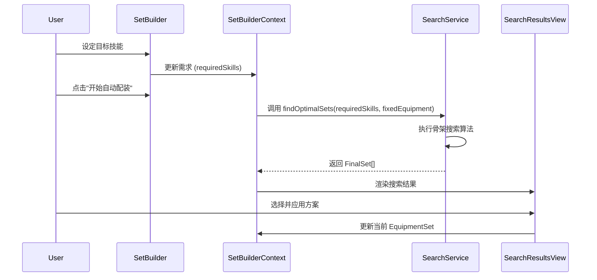

# MHWS配装器 (mhws-set-builder) - 技术架构设计文档

## 1. 项目概述

### 1.1 项目目标

MHWS配装器是一个专为《怪物猎人：荒野》(Monster Hunter Wilds)设计的综合配装工具。它旨在通过先进的搜索算法，帮助玩家在海量的防具、武器、装饰品和护石组合中，快速找到满足特定技能需求的最佳装备方案。

### 1.2 核心功能

1. **全装备管理**：涵盖武器、防具（五部位）、装饰品及护石的完整数据库管理。
2. **双模式配装**：
    - **手动模式**：玩家自由组合装备，实时查看技能统计和孔位状态。
    - **自动模式**：根据用户设定的目标技能，利用智能算法自动生成最优配装方案。
3. **智能搜索算法**：基于骨架搜索 (Scaffold-based Search) 的高效算法，支持复杂技能组合的快速求解。
4. **差分数据存储**：采用 Base Data + Delta 的差分存储架构，既保证了数据的持久化，又极大地减少了 LocalStorage 的占用。
5. **响应式设计**：适配 PC 和移动端，提供流畅的配装体验。

### 1.3 业务规则

- **装备体系**：一套完整的配装包含 1 件武器、5 件防具（头、胸、手、腰、腿）和 1 个护石。
- **技能系统**：技能通过装备自带或镶嵌装饰品获得。分为武器技能（Weapon）、防具技能（Armor）、系列技能 (Series)及组合技能 (Group) 。
- **孔位规则**：装备拥有不同等级（1-3级）和类型（武器/防具）的孔位，用于镶嵌对应等级的装饰品。
- **搜索逻辑**：算法优先保证满足用户设定的核心技能需求，并在此基础上优化剩余孔位或防御力。

---

## 2. 技术栈详细说明

### 2.1 前端框架

- **React 19.2.3 + TypeScript ~5.9.3**
  - 选择理由：组件化开发、强类型支持、生态成熟
  - 使用函数组件 + Hooks 模式
  - 严格的 TypeScript 类型定义

### 2.2 UI框架

- **Tailwind CSS 4.1.18**
  - 选择理由：快速开发、高度可定制、性能优秀
  - 使用 JIT 模式提升开发体验
- **shadcn/ui**
  - 选择理由：基于 Radix UI 的高质量组件库、支持主题定制
  - 主要使用组件：Button, Input, Select, Card, Table, Dialog, Badge 等

### 2.3 状态管理

- **React Context API + useReducer**
  - 选择理由：原生支持、无需额外依赖、适合中等复杂度应用
  - 全局状态包括：技能数据、护石数据、UI 状态、配装器上下文

### 2.4 数据存储与持久化

- **差分存储策略 (Differential Storage)**
  - **Base Data**: 官方提供的只读基础数据（技能、防具、武器、装饰品），从 JSON 文件加载。
  - **Delta Data**: 用户的修改（增、删、改）作为差分数据存储在 `LocalStorage` 中。
  - **DataStorage Service**: 统一管理数据的加载、合并 (Patch) 和保存。
- **导入/导出功能**
  - 支持全量 (Full) 或差分 (Diff) 模式的 JSON 文件导入导出。
  - 自动识别并处理数据迁移。

### 2.5 构建工具

- **Vite 7.3.1**
  - 选择理由：快速的冷启动、热更新、优化的打包。
  - ESM 原生支持。

### 2.6 开发工具

- **ESLint 9.39.2**：代码规范检查。
- **Prettier**：代码格式化。
- **TypeScript Strict Mode**：严格的类型检查。

---

## 3. 项目结构设计

```bash
mhws-set-builder/
├── public/                          # 静态资源
├── scripts/                         # 构建和数据生成脚本
│   ├── generate-database.ts         # 数据库生成脚本
│   └── json2csv/                    # 解包数据处理脚本
├── src/
│   ├── components/                  # React 组件
│   │   ├── charms/                  # 护石管理
│   │   ├── common/                  # 通用组件
│   │   ├── database/                # 数据库管理
│   │   ├── entities/                # 核心实体展示组件 (装备格、技能项)
│   │   ├── layout/                  # 布局组件
│   │   ├── set-builder/             # 配装器核心组件
│   │   ├── settings/                # 设置与数据管理
│   │   └── ui/                      # shadcn/ui 基础组件
│   ├── contexts/                    # 领域 Context (Armor, Skill, SetBuilder...)
│   ├── data/                        # 初始 CSV 数据
│   ├── hooks/                       # 自定义 Hooks
│   ├── lib/                         # 工具库配置 (utils)
│   ├── services/                    # 核心业务服务
│   │   ├── set-search/              # 搜索算法
│   │   └── storage/                 # 数据持久化与差分存储服务
│   ├── types/                       # TypeScript 类型定义
│   ├── utils/                       # 纯函数工具
│   ├── App.tsx                      # 应用主入口
│   └── main.tsx                     # 渲染入口
├── components.json                  # shadcn/ui 配置
├── package.json                     # 项目依赖
├── vite.config.ts                   # Vite 配置
└── ARCHITECTURE.md                  # 架构文档
```

---

## 4. 数据模型设计

### 4.1 核心领域模型 (src/types/core.ts)

#### 4.1.1 基础类型

- **Skill**: 技能定义，包含 `category` (weapon/armor/series/group)、`maxLevel`、`accessoryLevel` (1-3) 等。
- **Slot**: 孔位定义，包含 `type` (weapon/armor) 和 `level` (1-3)。
- **SkillWithLevel**: 装备或装饰品上携带的具体技能及等级。

#### 4.1.2 装备类型

- **Armor**: 防具定义，包含 `type` (helm/body/arm/waist/leg)、`skills`、`slots`、`defense`、`resistance`、`series`。
- **Weapon**: 武器定义，包含 `type`、`attack`、`critical`、`attribute`、`sharpness`、`skills`、`slots`。
- **Accessory**: 装饰品定义，包含 `slotLevel`、`skills`。
- **Charm**: 护石定义，包含 `skills`、`slots`、以及用于评估的 `equivalentSlots` 和 `keySkillValue`。

#### 4.1.3 护石评估与验证类型

- **EquivalentSlots**: 统计护石技能和孔位转换后的等效孔位数量。
- **CharmValidationResult**: 包含验证状态（ACCEPTED/REJECTED_AS_INFERIOR等）、更优护石引用及被完爆护石列表。

### 4.2 配装业务模型 (src/types/set-builder.ts)

#### 4.2.1 配装容器

- **SlottedEquipment**: 泛型容器，将装备与其镶嵌的装饰品关联。

  ```typescript
  interface SlottedEquipment<T> {
    equipment: T;
    accessories: (Accessory | null)[];
  }
  ```

- **EquipmentSet**: 包含武器、五部位防具、护石的完整配装容器。

#### 4.2.2 搜索相关类型

- **CategorizedSkills**: 将目标技能按获取方式分类（系列、组合、仅防具、武器装饰品、防具装饰品）。
- **SearchContext**: 搜索过程中的实时上下文，包含当前装备、当前技能总计、剩余孔位、技能缺口。
- **PreprocessedData**: 预处理后的索引数据，包含技能来源映射、各部位技能潜力 Map、装饰品快速查询表。
- **FinalSet**: 最终生成的配装方案，包含完整的装备组合、装饰品布局和剩余孔位。

---

## 5. 核心算法说明

### 5.1 护石评估与智能判定算法

#### 5.1.1 等效孔位与核心价值计算

- **等效孔位**：将护石的技能按其装饰品等级换算为对应类型的孔位，并与物理孔位累加。
- **核心价值**：核心技能等级总和 + 物理孔位权重（武器孔1/2/3级对应1/2/3价值，防具孔2/3级对应1价值）。

#### 5.1.2 护石智能判定 (Dominance Check)

在添加新护石时，执行严格的 **完爆检查 (Dominance Check)**：

1. **Dominance Logic**：若现有护石在所有技能等级和等效孔位上均优于或等于新护石，且至少有一项严格更优，则新护石被判定为“劣势” (`REJECTED_AS_INFERIOR`)。
2. **Acceptance Logic**：若新护石未被完爆，则根据其核心价值最高、等效孔位最高或拥有独特技能组合等理由予以接受。

### 5.2 配装搜索算法：骨架搜索 (Scaffold-based Search)

针对《荒野》复杂的技能系统，采用骨架搜索算法大幅缩小回溯范围。

#### 5.2.1 算法流程概述

1. **数据预处理 (`preprocess.ts`)**：
    - **装备筛选 (`equipment-filter.ts`)**：执行帕累托优化 (Pareto Optimization)，移除在技能、孔位和防御力上被其他装备“完爆”的劣势防具和护石。
    - **潜力计算**：计算每个防具部位对每个技能的 **理论最大潜力** (自带等级 + 最大孔位转换等级)，用于后续剪枝。
2. **武器技能提前求解 (`accessory-solver.ts`)**：
    - 在主循环中，优先使用武器和护石的孔位解决“武器技能”需求。
    - **分支策略**：若存在多种满足方案，算法会为每种方案创建独立的分支上下文。若无法满足则直接剪枝。
3. **骨架生成 (`scaffold-generator.ts`)**：
    - **核心逻辑**：针对系列技能 (Series) 和组合技能 (Group)，筛选出必须穿戴的防具组合。
    - 采用递归回溯生成所有可能的“骨架”（部分填充的装备方案）。
4. **回溯填充搜索 (`armor-search.ts`)**：
    - 在骨架的基础上，递归遍历剩余部位的防具。
    - **智能剪枝 (`helpers.ts`)**：实时判断当前分支是否可能满足剩余技能缺口。
5. **装饰品最终求解 (`accessory-solver.ts`)**：
    - 当找到一组防具组合后，计算剩余技能缺口，并利用回溯算法寻找最优装饰品布局。
6. **结果评估与排序 (`result-evaluator.ts`)**：
    - 对生成的方案按孔位价值（权重：3级=4, 2级=2, 1级=1）和冗余技能进行综合评分和排序。

#### 5.2.2 核心剪枝逻辑 (shouldPrune)

```typescript
function shouldPrune(currentSkills, remainingTypes, deficits, preprocessedData, availableSlots): boolean {
  for (const skill of deficits) {
    let potential = 0;
    // 1. 计算剩余部位的最大潜力
    for (const type of remainingTypes) {
      potential += preprocessedData.maxPotentialPerArmorType.get(type)?.get(skill.id) ?? 0;
    }
    
    // 2. 计算当前已有孔位能提供的最大潜力
    potential += calculateMaxSlotPotential(availableSlots, skill.id);
    
    // 3. 如果 (当前值 + 潜力) < 目标值，则剪枝
    if ((currentSkills.get(skill.id) ?? 0) + potential < skill.targetLevel) {
      return true;
    }
  }
  return false;
}
```

### 5.3 结果评估与排序 (`result-evaluator.ts`)

生成的配装方案会根据以下标准进行自动排序：

1. **剩余孔位价值**：优先展示拥有更多或更高等级剩余孔位的方案。
2. **关键技能溢出控制**：在孔位价值相同的情况下，优先选择额外携带的有用技能（Key Skills）较少的方案，以追求配装的精准度。

---

## 6. 组件架构设计

### 6.1 组件层级图



### 6.2 核心组件职责

- **SetBuilder**: 配装器核心界面，负责管理用户当前的技能需求和装备选择。
- **EquipmentCell**: 装备单元格，展示已选装备、孔位及装饰品，并触发选择器。
- **SearchResultsView**: 展示自动配装算法生成的 `FinalSet` 列表，支持方案预览和应用。
- **DatabaseManager**: 统一管理技能、防具、武器和装饰品的查看与编辑。
- **CharmManager**: 专门的护石管理界面，支持护石的智能判定与评估。
- **EquipmentSelector**: 通用选择器组件，用于从数据库中筛选并选择特定部位的装备。

---

## 7. 数据流设计

### 7.1 状态管理架构

项目采用多层级的 React Context 进行领域驱动的状态管理：

- **全局 Context**: `AppContext` (配置), `ThemeContext`.
- **领域 Context**:
  - `SkillContext`, `ArmorContext`, `WeaponContext`, `AccessoryContext`, `CharmContext`: 负责各自领域数据的 CRUD 及持久化。
  - `SetBuilderContext`: 核心业务 Context，管理配装模式（手动/自动）、用户需求、当前选择的 `EquipmentSet` 以及搜索结果。

### 7.2 核心业务流：自动配装



---

## 8. 扩展性与维护

### 8.1 预留的扩展接口

- **多语言支持 (i18n)**：架构设计上预留了加载不同语言包的能力。
- **云端同步**：`DataStorage` 服务预留了对接云端 API 的接口，未来可支持配装方案云备份。

### 8.2 数据维护

- **脚本化更新**：通过 `scripts/generate-database.ts` 可快速从 CSV 源文件重新生成基础数据库 JSON，便于应对游戏版本更新。
- **版本迁移**：`DataStorage` 服务内置了版本检测与迁移逻辑，确保用户数据在应用升级时的平滑过渡。
