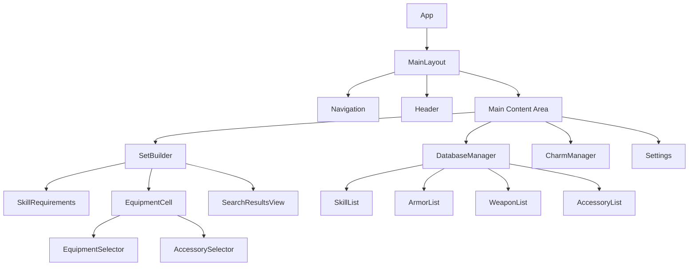
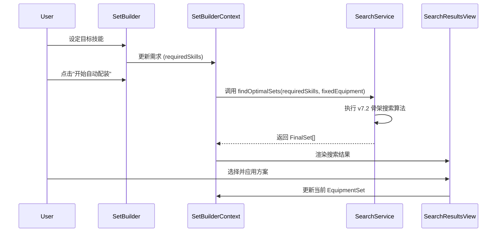
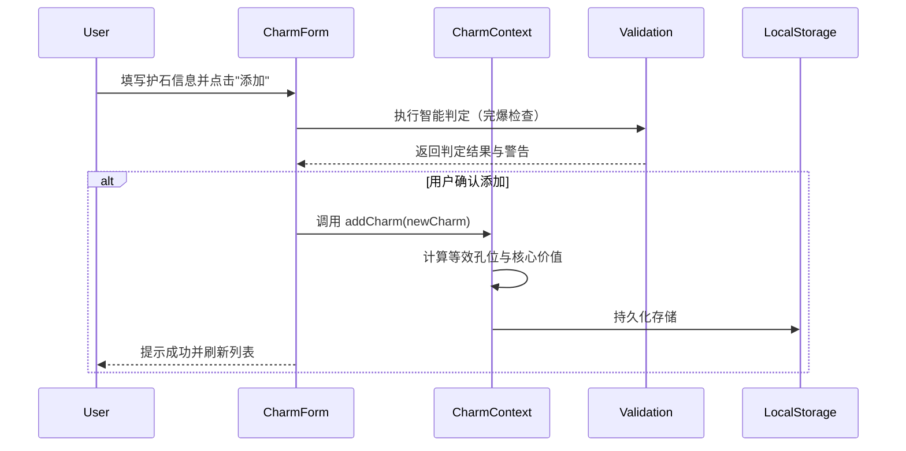

# MHWS配装器 (mhws-set-builder) - 技术架构设计文档

## 1. 项目概述

### 1.1 项目目标

MHWS配装器是一个专为《怪物猎人：荒野》(Monster Hunter Wilds)设计的综合配装工具。它旨在通过先进的搜索算法，帮助玩家在海量的防具、武器、装饰品和护石组合中，快速找到满足特定技能需求的最佳装备方案。

### 1.2 核心功能

1. **全装备管理**：涵盖武器、防具（五部位）、装饰品及护石的完整数据库管理。
2. **双模式配装**：
    - **手动模式**：玩家自由组合装备，实时查看技能统计和孔位状态。
    - **自动模式**：根据用户设定的目标技能，利用智能算法自动生成最优配装方案。
3. **智能搜索算法**：基于骨架搜索 (Scaffold-based Search) 的高效算法，支持复杂技能组合的快速求解。
4. **数据库管理**：支持官方数据的自动加载、自定义数据的录入以及数据的导入/导出。
5. **响应式设计**：适配 PC 和移动端，提供流畅的配装体验。

### 1.3 业务规则

- **装备体系**：一套完整的配装包含 1 件武器、5 件防具（头、胸、手、腰、腿）和 1 个护石。
- **技能系统**：技能通过装备自带或镶嵌装饰品获得。分为系列技能、组合技能及普通技能。
- **孔位规则**：装备拥有不同等级（1-3级）和类型（武器/防具）的孔位，用于镶嵌对应等级的装饰品。
- **搜索逻辑**：算法优先保证满足用户设定的核心技能需求，并在此基础上优化剩余孔位或防御力。

---

## 2. 技术栈详细说明

### 2.1 前端框架

- **React 19.1.1 + TypeScript ~5.9.3**
  - 选择理由：组件化开发、强类型支持、生态成熟
  - 使用函数组件 + Hooks模式
  - 严格的TypeScript类型定义

### 2.2 UI框架

- **Tailwind CSS 4.1.14**
  - 选择理由：快速开发、高度可定制、性能优秀
  - 使用JIT模式提升开发体验
- **shadcn/ui**
  - 选择理由：基于Radix UI的高质量组件库、支持主题定制
  - 主要使用组件：Button, Input, Select, Card, Table, Dialog, Badge等

### 2.3 状态管理

- **React Context API + useReducer**
  - 选择理由：原生支持、无需额外依赖、适合中等复杂度应用
  - 全局状态包括：技能数据、护石数据、UI状态

### 2.4 数据存储

- **LocalStorage（主存储）**
  - 存储技能和护石的完整数据
  - 支持离线访问
- **导入/导出功能**
  - 支持JSON文件的导入和导出
  - 便于数据备份和迁移

### 2.5 构建工具

- **Vite 7.1.7**
  - 选择理由：快速的冷启动、热更新、优化的打包
  - ESM原生支持

### 2.6 开发工具

- **ESLint 9.36.0**：代码规范检查
- **TypeScript Strict Mode**：严格的类型检查

---

## 3. 项目结构设计

```bash
mhws-set-builder/
├── public/                          # 静态资源
├── scripts/                         # 构建和数据生成脚本
├── src/
│   ├── components/                  # React组件
│   │   ├── charms/                  # 护石管理组件
│   │   ├── common/                  # 通用组件
│   │   ├── database/                # 数据库管理组件 (技能、装备、装饰品)
│   │   ├── entities/                # 核心实体展示组件 (装备格、技能项)
│   │   ├── layout/                  # 布局组件
│   │   ├── set-builder/             # 配装器核心组件 (主界面、结果视图)
│   │   ├── settings/                # 设置与数据管理
│   │   └── ui/                      # UI基础组件 (shadcn/ui)
│   ├── contexts/                    # 领域 Context 状态管理
│   ├── data/                        # 初始 CSV 数据
│   ├── hooks/                       # 自定义 Hooks
│   ├── lib/                         # 外部库配置 (utils)
│   ├── services/                    # 核心业务服务
│   │   ├── set-search/              # v7.2 搜索算法实现
│   │   └── storage/                 # 数据持久化服务
│   ├── types/                       # TypeScript 类型定义
│   ├── utils/                       # 通用工具函数
│   ├── App.tsx                      # 应用主入口
│   └── main.tsx                     # 渲染入口
├── components.json                  # shadcn/ui配置
├── package.json                     # 项目依赖
└── ARCHITECTURE.md                  # 架构文档
```

---

## 4. 数据模型设计

### 4.1 核心领域模型 (src/types/core.ts)

#### 4.1.1 基础类型

- **Skill**: 技能定义，包含 `category` (weapon/armor/series/group)、`maxLevel`、`accessoryLevel` (1-3) 等。
- **Slot**: 孔位定义，包含 `type` (weapon/armor) 和 `level` (1-3)。
- **SkillWithLevel**: 装备或装饰品上携带的具体技能及等级。

#### 4.1.2 装备类型

- **Armor**: 防具定义，包含 `type` (helm/body/arm/waist/leg)、`skills`、`slots`、`defense`、`resistance`、`series`。
- **Weapon**: 武器定义，包含 `type`、`attack`、`critical`、`attribute`、`sharpness`、`skills`、`slots`。
- **Accessory**: 装饰品定义，包含 `slotLevel`、`skills`。
- **Charm**: 护石定义，包含 `skills`、`slots`、以及用于评估的 `equivalentSlots` 和 `keySkillValue`。

#### 4.1.3 护石评估与验证类型

- **EquivalentSlots**: 统计护石技能和孔位转换后的等效孔位数量。
- **CharmValidationResult**: 包含验证状态（ACCEPTED/REJECTED_AS_INFERIOR等）、更优护石引用及被完爆护石列表。

### 4.2 配装业务模型 (src/types/set-builder.ts)

#### 4.2.1 配装容器

- **SlottedEquipment**: 泛型容器，将装备与其镶嵌的装饰品关联。

  ```typescript
  interface SlottedEquipment<T> {
    equipment: T;
    accessories: (Accessory | null)[];
  }
  ```

- **EquipmentSet**: 包含武器、五部位防具、护石的完整配装容器。

#### 4.2.2 搜索相关类型

- **CategorizedSkills**: 将目标技能按获取方式分类（系列、组合、仅防具、武器装饰品、防具装饰品）。
- **SearchContext**: 搜索过程中的实时上下文，包含当前装备、当前技能总计、剩余孔位、技能缺口。
- **PreprocessedData**: 预处理后的索引数据，包含技能来源映射、各部位技能潜力 Map、装饰品快速查询表。
- **FinalSet**: 最终生成的配装方案，包含完整的装备组合、装饰品布局和剩余孔位。

### 4.3 存储模型

系统采用多键值存储方案，将 `skills`, `accessories`, `armor`, `weapons`, `charms` 分开存储在 `LocalStorage` 中，并由 `DataStorage` 服务统一管理。

---

## 5. 核心算法说明

### 5.1 护石评估与智能判定算法

#### 5.1.1 等效孔位与核心价值计算

- **等效孔位**：将护石的技能按其装饰品等级换算为对应类型的孔位，并与物理孔位累加。
- **核心价值**：核心技能等级总和 + 物理孔位权重（武器孔1/2/3级对应1/2/3价值，防具孔2/3级对应1价值）。

#### 5.1.2 护石智能判定（完爆检查）

在添加新护石时，执行多阶段判定：

1. **Dominance Check (完爆检查)**：若现有护石在所有技能等级和等效孔位上均优于或等于新护石，且至少有一项严格更优，则新护石被视为“劣势”而被建议拒绝。
2. **Acceptance Logic**：根据核心价值最高、等效孔位最高或拥有独特技能等理由接受新护石。

### 5.2 配装搜索算法：骨架搜索 (Scaffold-based Search)

针对《荒野》复杂的技能系统，采用骨架搜索算法大幅缩小回溯范围。

#### 5.2.1 算法流程概述

1. **数据预处理 (`preprocess.ts`)**：
    - 计算每个防具部位对每个技能的 **理论最大潜力** (自带等级 + 最大孔位转换等级)。
    - 建立技能到装备/装饰品的快速索引。
2. **武器技能提前求解 (`accessory-solver.ts`)**：
    - 在搜索开始前，优先使用武器和护石的孔位解决“武器专用技能”需求。若无法满足则直接剪枝。
3. **骨架生成 (`scaffold-generator.ts`)**：
    - **核心逻辑**：针对系列技能 (Series) 和组合技能 (Group)，筛选出必须穿戴的防具组合。
    - 生成的骨架固定了部分防具位置，剩余位置留空待填充。
4. **回溯填充搜索 (`armor-search.ts`)**：
    - 在骨架的基础上，递归遍历剩余部位的防具。
    - **智能剪枝 (`helpers.ts`)**：利用预处理的“最大潜力”Map，判断当前分支是否可能满足剩余技能缺口。
5. **装饰品最终求解 (`accessory-solver.ts`)**：
    - 当找到一组防具组合后，使用贪心+回溯算法填充装饰品，验证是否能完全满足所有普通技能需求。

#### 5.2.2 核心剪枝逻辑 (shouldPrune)

```pseudocode
function shouldPrune(currentSkills, remainingTypes, deficits, preprocessedData, availableSlots):
  for each skill in deficits:
    potential = 0
    // 1. 计算剩余部位的最大潜力
    for each type in remainingTypes:
      potential += preprocessedData.maxPotentialPerArmorType[type][skill.id]
    
    // 2. 计算当前已有孔位能提供的最大潜力
    potential += calculateMaxSlotPotential(availableSlots, skill.id)
    
    // 3. 如果 (当前值 + 潜力) < 目标值，则剪枝
    if currentSkills[skill.id] + potential < deficits[skill.id].targetLevel:
      return true
  return false
```

#### 5.2.3 骨架生成逻辑 (Scaffold Generation)

骨架搜索通过固定“关键件”来减少无效组合。例如，若需求“雷狼龙之魂”，算法会先生成包含雷狼龙防具件数的各种组合（骨架），而不是盲目遍历所有防具。

---

## 6. 组件架构设计

### 6.1 组件层级图



### 6.2 核心组件职责

- **SetBuilder**: 配装器核心界面，负责管理用户当前的技能需求和装备选择。
- **EquipmentCell**: 装备单元格，展示已选装备、孔位及装饰品，并触发选择器。
- **SearchResultsView**: 展示自动配装算法生成的 `FinalSet` 列表，支持方案预览和应用。
- **DatabaseManager**: 统一管理技能、防具、武器和装饰品的查看与编辑。
- **CharmManager**: 专门的护石管理界面，支持护石的智能判定与评估。
- **EquipmentSelector**: 通用选择器组件，用于从数据库中筛选并选择特定部位的装备。

---

## 7. 数据流设计

### 7.1 状态管理架构

项目采用多层级的 React Context 进行领域驱动的状态管理：

- **全局 Context**: `AppContext` (配置)、`ThemeContext`。
- **领域 Context**:
  - `SkillContext`, `ArmorContext`, `WeaponContext`, `AccessoryContext`, `CharmContext`: 负责各自领域数据的 CRUD 及持久化。
  - `SetBuilderContext`: 核心业务 Context，管理配装模式（手动/自动）、用户需求、当前选择的 `EquipmentSet` 以及搜索结果。

### 7.2 核心业务流：自动配装



### 7.3 关键数据流程：添加护石



---

## 8. 数据持久化方案

### 8.1 LocalStorage 存储策略

应用数据按领域拆分存储，以提高读写性能并降低单一键值的体积压力。主要键名包括：

- `mhws-set-builder-skills`: 技能定义数据。
- `mhws-set-builder-armor`: 防具数据库。
- `mhws-set-builder-weapons`: 武器数据库。
- `mhws-set-builder-accessories`: 装饰品数据库。
- `mhws-set-builder-charms`: 用户自定义护石。
- `mhws-set-builder-settings`: 应用配置。

### 8.2 数据导入与导出

支持以 JSON 格式导出完整数据库，便于用户在不同设备间同步。导出文件包含版本号和导出时间戳，导入时会进行严格的 Schema 验证以确保数据一致性。

### 8.3 初始数据加载

应用首次运行时，会从 `src/data/*.csv` 自动解析并加载官方提供的基础数据（技能、防具、武器、装饰品），确保用户开箱即用。

---

## 9. 扩展性设计

### 9.1 预留的扩展接口

- **多语言支持 (i18n)**：预留了加载不同语言包、切换应用语言的接口。
- **云端同步**：预留了与云服务同步数据的接口，支持将配装方案备份到云端。
- **更多装备属性**：数据模型预留了诸如武器独有属性（拨刀、瓶类型等）的扩展空间。

### 9.2 数据迁移策略

- **数据迁移管理器 (`migration.ts`)**：在应用启动时自动检测数据版本并执行必要的迁移，确保旧版本的护石或配装数据能平滑过渡到新版本。

---

## 10. 性能优化策略

### 10.1 搜索性能优化

- **多线程搜索 (Web Worker)**：对于极其复杂的搜索需求，考虑将搜索逻辑移至 Web Worker，避免阻塞主线程 UI。
- **搜索结果流式渲染**：在搜索进行中实时展示已发现的方案，提升用户感知性能。

### 10.2 渲染性能优化

- **虚拟滚动**：在数据库列表（如 170+ 技能或海量防具）中使用虚拟滚动技术。
- **精细化 Memo**：对 `EquipmentCell` 等频繁重渲染的组件使用 `React.memo` 和 `useMemo` 进行深度优化。

---

## 11. 安全性与健壮性

### 11.1 数据验证

- **Schema 验证**：在数据导入阶段使用严格的类型检查。
- **输入过滤**：对用户自定义的护石名称和备注进行清理，防止潜在的注入风险。

### 11.2 异常处理

- **全局错误边界 (ErrorBoundary)**：捕获并友好展示运行时错误，防止应用彻底崩溃。
- **搜索超时控制**：为复杂的自动配装任务设置时间限制，防止浏览器长时间无响应。

---

## 附录

### A. 术语表

- **配装方案 (Equipment Set)**：包含武器、防具、护石及装饰品的完整组合。
- **骨架 (Scaffold)**：配装方案的雏形，通常固定了满足核心约束（如系列技能）的关键装备。
- **潜力 (Potential)**：指某件装备或某个部位在理想状态下（自带+孔位填充）能提供的最高技能等级。
- **剪枝 (Pruning)**：在搜索树中提前放弃不可能产生有效解的分支，是提高搜索效率的关键。
